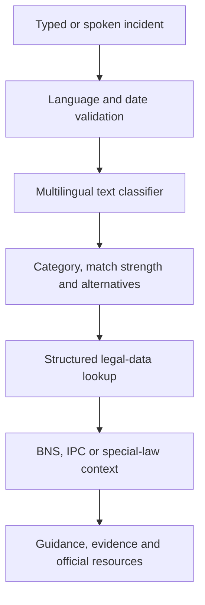

# NyayaAI

### Multilingual Incident Classification and Indian Legal-Awareness Assistant

[](https://santhosh-crime-ai-assistant.onrender.com/)
[](https://www.python.org/)
[](https://fastapi.tiangolo.com/)
[](#testing)
[](https://github.com/Santhoshguthpe/crime-detection-ipc-system/actions/workflows/ci.yml)

NyayaAI is a privacy-first final-year engineering project that helps a user understand the possible legal direction of a described incident. A user can type or speak in **English, Hindi, or Telugu**. The application predicts a preliminary crime category and retrieves structured Indian legal-awareness information, including current BNS references, legacy IPC context, possible punishment, practical next steps, and official assistance resources.

> [!IMPORTANT]
> NyayaAI is an educational legal-awareness tool. It does not file a complaint, determine whether an offence occurred, decide guilt, provide legal advice, or replace police, lawyers, and courts. Every legal result requires professional verification.

<p align="center">
  
</p>

## Live application

**Production:** [https://santhosh-crime-ai-assistant.onrender.com/](https://santhosh-crime-ai-assistant.onrender.com/)

The Render free service may take a short time to wake up after inactivity.

## Problem statement

People often describe an incident using everyday language but may not know:

- the possible crime category;
- whether a current BNS or older IPC reference may be relevant;
- what information should be preserved;
- which official assistance service to contact; or
- how to access the information in their preferred language.

NyayaAI reduces this first-level information gap through a simple multilingual voice and text interface.

## What makes NyayaAI different

| Common crime-prediction projects | NyayaAI |
|---|---|
| Forecast future crime using historical location and time data | Analyses a user-described incident |
| Mainly designed for police analytics | Designed for public legal awareness |
| Often provides only a predicted label | Provides category, explanation, legal context and next steps |
| Usually supports one language | Supports English, Hindi and Telugu |
| May generate a difficult-to-explain result | Shows match strength, supporting words and alternatives |
| Often uses only IPC-era data | Provides date-aware BNS and legacy IPC context |

## Key features

### User experience

- Text and speech input in English, Hindi and Telugu
- Duplicate-safe speech recognition
- Optional incident date for BNS/IPC context
- Immediate-danger indicator and 112 emergency direction
- Responsive interface for desktop, tablet and mobile
- Copyable assessment summary
- Browser print and save-to-PDF report
- Accessible labels, keyboard states and reduced-motion support

### Explainable machine learning

- TF-IDF word and character features
- Logistic Regression text classifier
- Strong, moderate or preliminary match labels
- Words that supported the predicted category
- Two alternative categories for transparency
- Low-confidence rejection when details are insufficient
- No artificial 100% certainty for exact training examples

### Responsible legal layer

- Current BNS overlay for 23 covered crime categories
- Legacy IPC reference for incidents before 1 July 2024
- Current BNS equivalent displayed beside legacy IPC results
- Separate handling for the IT Act, NDPS Act, PWDVA and Prevention of Corruption Act
- Structured punishment and consequence records
- Official Ministry of Home Affairs and India Code sources
- Clear explanation of what the result cannot decide

### Practical guidance

- Multilingual recommended next steps
- Category-specific evidence-preservation checklist
- Emergency Response Support System: **112**
- National Cyber Crime Helpline: **1930**
- NALSA Legal Aid Helpline: **15100**

### Privacy

- No registration or login
- No incident-history database
- No analytics SDK in the application
- Incident text is processed in server memory for the current response
- Interface asks users not to enter private identifiers

## System workflow



The machine-learning model predicts only a category. It cannot create or modify legal sections, punishments, or consequences. Those values come from maintained JSON records.

## Architecture

| Layer | Technology | Responsibility |
|---|---|---|
| Interface | HTML, CSS and JavaScript | Form, translations, voice input and safe result rendering |
| API | FastAPI and Pydantic | Validation, analysis endpoint and health endpoint |
| ML | scikit-learn | Multilingual text-category prediction |
| Legal reference | JSON | BNS, legacy IPC and special-law records |
| Guidance | JSON | Localised next steps, evidence prompts and official resources |
| Testing | Pytest and HTTPX | Classifier, API, date, privacy and legal-layer checks |
| Deployment | Uvicorn and Render | HTTPS production hosting |

More detail is available in [docs/ARCHITECTURE.md](docs/ARCHITECTURE.md).

## Technology stack

- Python 3.12
- FastAPI
- Uvicorn
- Pydantic
- scikit-learn
- Jinja2
- HTML5, CSS3 and JavaScript
- Web Speech Recognition API
- Pytest and HTTPX
- GitHub Actions
- Render

No paid AI API, API key, external database, spaCy model, PyTorch, or transformer download is required.

## Repository structure

```text
.
├── .github/
│   ├── ISSUE_TEMPLATE/
│   │   ├── bug_report.md
│   │   └── feature_request.md
│   ├── workflows/
│   │   └── ci.yml
│   └── pull_request_template.md
├── docs/
│   └── ARCHITECTURE.md
├── static/
│   ├── images/
│   │   └── legal-ai-hero.webp
│   ├── app.js
│   └── styles.css
├── templates/
│   └── index.html
├── tests/
│   ├── test_api.py
│   └── test_classifier.py
├── .gitignore
├── .python-version
├── bns_updates.json
├── CHANGELOG.md
├── CITATION.cff
├── CONTRIBUTING.md
├── crime_detector.py
├── guidance_data.json
├── ipc_data.json
├── keyword_mapper.json
├── main.py
├── multilingual_examples.json
├── README.md
├── render.yaml
├── requirements.txt
└── SECURITY.md
```

## Installation

### Requirements

- Python 3.10 or newer
- Git
- Current Chrome or Edge for the best voice-input support

### 1. Clone the repository

```bash
git clone https://github.com/Santhoshguthpe/crime-detection-ipc-system.git
cd crime-detection-ipc-system
```

The professional v4 work currently lives on the `feature/multilingual-ai-voice-v2` branch until Pull Request #1 is merged:

```bash
git switch feature/multilingual-ai-voice-v2
```

### 2. Create a virtual environment

Windows PowerShell:

```powershell
py -3.12 -m venv venv
venv\Scripts\Activate.ps1
```

Windows Command Prompt:

```bat
py -3.12 -m venv venv
venv\Scripts\activate.bat
```

macOS or Linux:

```bash
python3 -m venv venv
source venv/bin/activate
```

### 3. Install dependencies

```bash
python -m pip install --upgrade pip
python -m pip install -r requirements.txt
```

### 4. Start the application

```bash
python -m uvicorn main:app --reload
```

Open:

- Application: [http://127.0.0.1:8000](http://127.0.0.1:8000)
- Interactive API documentation: [http://127.0.0.1:8000/docs](http://127.0.0.1:8000/docs)
- Health endpoint: [http://127.0.0.1:8000/health](http://127.0.0.1:8000/health)

## API usage

### Endpoint

```http
POST /api/analyze
Content-Type: application/json
```

### Request

```json
{
  "description": "चाकू दिखाकर पैसे लूट लिए",
  "language": "hi",
  "incident_date": "2025-01-15",
  "immediate_danger": false
}
```

`language` accepts `en`, `hi`, or `te`. The incident date is optional and cannot be in the future.

### Response outline

```json
{
  "matched": true,
  "analysis_id": "NYA-XXXXXXXXXX",
  "language": "hi",
  "prediction": {
    "crime": "robbery",
    "label": "लूट",
    "match_strength": "strong",
    "signals": ["चाकू", "लूट"]
  },
  "alternatives": [],
  "legal_reference": {
    "law": "Bharatiya Nyaya Sanhita, 2023",
    "section": "Section 309(4) BNS",
    "legacy_section": "Section 392 IPC"
  },
  "guidance": {
    "next_steps": [],
    "evidence": [],
    "resources": []
  }
}
```

The complete response also contains punishment, consequences, source information, timestamps, privacy information and disclaimers.

## How the model works

1. English examples are loaded from `keyword_mapper.json`.
2. Hindi and Telugu examples and labels are loaded from `multilingual_examples.json`.
3. Text is normalised.
4. Word and character patterns are converted into numeric TF-IDF features.
5. Logistic Regression predicts the most likely crime categories.
6. The highest result is converted into a clear match-strength label.
7. Supporting words are identified for simple explainability.
8. The predicted category retrieves maintained legal and guidance records.

### Honest evaluation note

The 13 automated tests confirm application behaviour; they are **not** a claim of 100% machine-learning accuracy. A publishable accuracy claim requires a larger independent multilingual test dataset with precision, recall, F1-score and confusion-matrix evaluation.

## Testing

Run all tests:

```bash
python -m pytest -q
```

Additional validation:

```bash
python -m json.tool bns_updates.json
python -m json.tool guidance_data.json
python -m compileall -q main.py crime_detector.py
node --check static/app.js
```

The test suite covers:

- English, Hindi and Telugu classification;
- explainability signals;
- current BNS results;
- legacy IPC selection by incident date;
- special-law categories;
- future-date rejection;
- privacy and guidance fields;
- API and health endpoints; and
- page assets and application metadata.

GitHub Actions runs the checks automatically for pushes and pull requests.

## Demo scenarios

| Scenario | What it demonstrates |
|---|---|
| English robbery without a date | Current BNS reference, IPC context and explainability |
| Same robbery dated in 2023 | IPC primary result with current BNS equivalent |
| Hindi cyber fraud | Hindi guidance, IT Act reference and 1930 resource |
| Telugu stalking description | Telugu interface, classification and safety guidance |
| Immediate-danger option | Priority 112 emergency message |

## Deployment

The repository contains a Render blueprint:

```yaml
buildCommand: pip install -r requirements.txt
startCommand: uvicorn main:app --host 0.0.0.0 --port $PORT
```

The production service uses Python 3.12 and the `/health` endpoint for health checks.

## Responsible-AI boundaries

NyayaAI cannot determine:

- whether a crime legally occurred;
- which exact subsection applies;
- guilt or innocence;
- arrest, bail or cognizable classification;
- evidence admissibility; or
- the final punishment or sentence.

The classifier is deliberately separated from legal data. The model predicts a category, while maintained JSON records supply sections and punishment text. This reduces the risk of invented legal information.

## Current limitations

- Training data is small and created for an academic prototype.
- Results cover broad categories rather than every Indian offence.
- Legal records require continuing review by qualified Indian legal professionals.
- Statutory content is displayed in English to avoid unreviewed automatic legal translation.
- Browser speech recognition varies by browser, device and noise level.
- The application does not file FIRs or cybercrime complaints.
- It does not store cases or support professional case management.

## Roadmap

- Build a larger anonymised and expert-labelled multilingual dataset.
- Publish precision, recall, F1-score and confusion matrices by language.
- Compare Logistic Regression, SVM and transformer baselines.
- Add lawyer-reviewed Hindi and Telugu legal summaries.
- Add legal-data versioning and review history.
- Add administrator review without storing public incident text.
- Add accessibility and security audits.
- Add rate limiting and structured production logging.

## Official resources

- [Ministry of Home Affairs — New Criminal Laws](https://www.mha.gov.in/en/commoncontent/new-criminal-laws)
- [India Code — Bharatiya Nyaya Sanhita, 2023](https://www.indiacode.nic.in/bitstream/123456789/20062/1/a202345.pdf)
- [India Code — Indian Penal Code, 1860](https://www.indiacode.nic.in/bitstream/123456789/15289/1/ipc_act.pdf)
- [MHA — Emergency Response Support System 112](https://www.mha.gov.in/en/commoncontent/emergency-response-support-system-erss)
- [National Cyber Crime Reporting Portal — 1930](https://cybercrime.gov.in/)
- [National Legal Services Authority — 15100](https://nalsa.gov.in/)

## Contributing

Read [CONTRIBUTING.md](CONTRIBUTING.md) before opening a pull request. Changes to legal sections, punishments or legal consequences must include an official source and require specialist review.

## Security

Do not submit real incident descriptions, credentials, private identifiers or security vulnerabilities in a public issue. Read [SECURITY.md](SECURITY.md) for reporting guidance.

## Citation

Academic users can cite the software using [CITATION.cff](CITATION.cff).

## License

No open-source license has been selected yet. Until the repository owner adds one, copyright law applies and reuse rights are not automatically granted.

## Author

**Santhosh Guthpe**  
B.Tech Computer Science and Engineering — Data Science  
Final-year major project

---

If anyone is in immediate danger in India, call **112**. For urgent cyber financial fraud, call **1930**. NyayaAI itself does not contact emergency services.
