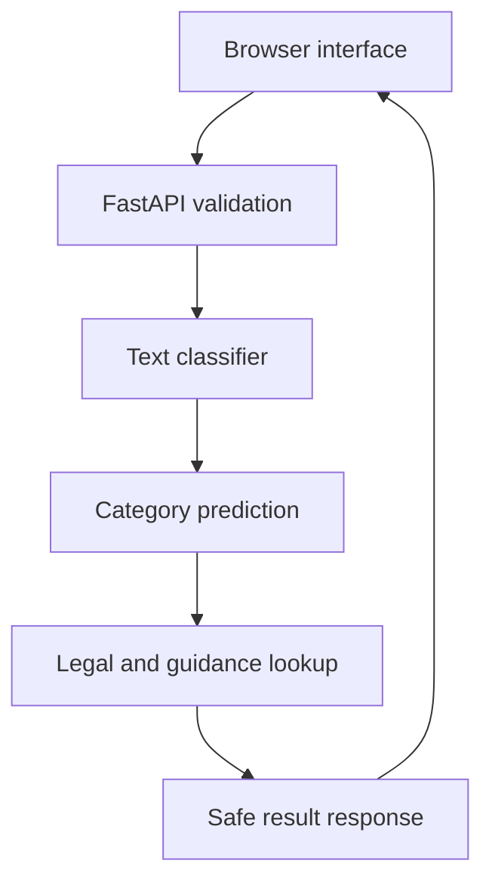

# NyayaAI Architecture

This document explains how the application is organised and where its trust boundaries are.

## Design goals

- Make incident reporting simple in English, Hindi and Telugu.
- Keep the prediction understandable instead of presenting a black-box verdict.
- Prevent the classifier from inventing laws or punishments.
- Process descriptions without creating user accounts or an incident-history database.
- Keep the project small enough to run locally and on a modest cloud service.

## System overview

## Components

| Component | Main files | Responsibility |
|---|---|---|
| Browser interface | `templates/index.html`, `static/styles.css`, `static/app.js` | Language selection, text/voice capture, API request and safe display |
| API | `main.py` | Request validation, health check, result assembly and error handling |
| Classifier | `crime_detector.py` | TF-IDF feature extraction, Logistic Regression prediction and explainability |
| Training examples | `keyword_mapper.json`, `multilingual_examples.json` | Synthetic and curated phrases in three languages |
| Legal reference | `ipc_data.json`, `bns_updates.json` | Maintained IPC, BNS and selected special-law context |
| User guidance | `guidance_data.json` | Localised next steps, evidence prompts and official services |
| Verification | `tests/` | Behaviour, privacy, dates, multilingual output and API regression tests |

## Request flow

1. The browser collects the description, language, optional date and danger status.
2. Client-side controls prevent repeated speech fragments and accidental duplicate submission.
3. Pydantic validates the request on the server.
4. The classifier predicts a broad category and calculates match strength, signal words and alternatives.
5. The incident date chooses the applicable reference context.
6. The API retrieves legal facts from JSON; the model never generates them.
7. The API returns the assessment, limitations, guidance and official resources.
8. The browser renders text without treating user input as executable HTML.

## Legal-context selection

| Incident context | Primary display | Additional context |
|---|---|---|
| On or after 1 July 2024 | BNS reference | Legacy IPC mapping when available |
| Before 1 July 2024 | Legacy IPC reference | Current BNS equivalent when available |
| Special-law category | Relevant special Act | General criminal-law context only when maintained |
| Date not supplied | Current BNS-oriented awareness | Clear date assumption notice |

The displayed mapping is educational and needs professional verification. Actual legal treatment depends on the facts, amendments, jurisdiction, investigation and court interpretation.

## Data and privacy boundary

NyayaAI has no account system, analytics SDK or incident-history database. The description is sent over HTTPS in production and processed in application memory for the current response. Hosting-provider access logs may still contain normal request metadata, so users are told not to enter direct identifiers.

The current classifier is trained when the application starts from repository data. It does not learn from public submissions.

## Responsible-AI controls

- Broad category prediction instead of a finding of guilt.
- Low-confidence response for incomplete or unrelated descriptions.
- Match strength and supporting signals instead of false precision.
- Alternative categories to show uncertainty.
- Legal data retrieved from structured files, not generated by the model.
- Emergency and official-help routes shown separately from the prediction.
- Prominent limits and professional-verification reminders.

## Deployment

Render starts the FastAPI application with Uvicorn. The `/health` endpoint supports monitoring. GitHub Actions validates JSON, compiles Python files, runs the test suite and checks browser JavaScript syntax on pushes and pull requests.

## Scaling path

For a larger deployment, add rate limiting, structured logs without incident text, dependency scanning, legal-data versioning, independent multilingual evaluation, expert review, and a privacy impact assessment before adding accounts or persistent storage.
